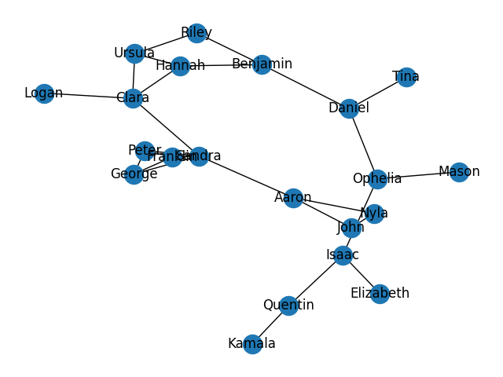

# Resturants in Newark

**CISC320 Spring 2023 Lesson 19 - Graph Applications**

Group Members:
* Heni Patel (heni@udel.edu)
* Christopher Bennett (cbcolleg@udel.edu)
* Ella Wilkins (ellawlk@udel.edu)
* Sneha Nangelimalil (snehnang@udel.edu)

Description of project

## Installation Code

```sh
$> pip install networkx
```

## Python Environment Setup

```python
import networkx as nx
import matplotlib.pyplot as plt
from networkx.algorithms import tree
import pprint
import json
```

# Problem #3: Get to the Closest Restaurant.

**Informal Description**:
>You've just arrived at a restaurant after a long day of work wanting to get inside.
    Unfortunately, they had just closed their doors before you could even enter.
    You realized that all the other stores around you are probably closing at the same time too.
    Given a city full of restaurants, we would like to know which one is the closest from any starting point.
    Accounting for any traffic along the way, such as long traffic lights, pedestrians, or one-way streets.
> Even if we were to find the closest store, they may also be closing. So it would probably be handy to get all
> closest stores to plan accordingly.
> 

> **Formal Description**:
>  * Input: Weighted Graph G representing 
>  all of the restaurants in the area. Weighted edges
>  represent distance between them.
> 
>  * Output: An adjacency matrix representing the shortest 
>  paths between all nodes.
> 
> You'll need to geet the shortest distance from a graph,
> accounting for traffic jams which are the graphs weights, or if that store is
> closing you'll probably want to just find the next shortest path.
> * Using the Floyd-Washall algorithm, we will calculate the shortest paths from any starting
> location on the graph using an adjacency matrix.


**Graph Problem/Algorithm**: Floyd–Warshall algorithm


**Setup code**:

```python
def dijkstra_graph():

    g = nx.Graph()

    vertices = ["FG", "CT", "I", "DP", "G", "DC", "EB", "MC", "DE", "WE",
                "CF", "UD", "WA", "TA", "K", "CG", "TW", "G2G", "Q", "DU"]

    labels = {"FG": "Five Guys", "CT": "Claymont", "I": "Insomnia", "DP": "Deer Park",
              "G": "Grotto's", "DC": "Drip Cafe", "EB": "Einstein Bagels", "MC": "Mcdonald's", "DE": "Denny's",
              "WE": "Wendy's", "CF": "Chick Fil-A", "UD": "UDairy", "WA": "Wawa", "TA": "Taverna", "K": "Kate's",
              "CG": "Cafe Gelato", "TW": "Tasty Wok", "G2G": "Greens To Go", "Q": "Quiznos", "DU": "Dunkin"}
    g.add_nodes_from(vertices)

    vertex_count = 0
    while vertex_count < len(vertices):
        edgeCount = vertex_count + 1
        while edgeCount < len(vertices):
            if vertices[vertex_count] not in vertices[edgeCount]:
                g.add_edge(vertices[vertex_count], vertices[edgeCount])
                node1 = vertices[vertex_count]
                node2 = vertices[edgeCount]
                g[node1][node2]['weight'] = edgeCount
            edgeCount += 8
        vertex_count += 1


    #nx.draw(g, with_labels=True, font_weight='bold')

    pos = nx.spring_layout(g)
    nx.draw(g, pos, node_size=800)
    edge_labels = nx.get_edge_attributes(g, 'weight')
    nx.draw_networkx_edge_labels(g, pos, edge_labels=edge_labels, label_pos=0.5)
    nx.draw_networkx_labels(g, pos, labels=labels, font_size=7, font_color='black')
    plt.show()

```

**Visualization**:


**Solution code:**

```python
    dist = nx.floyd_warshall(g)
    for key in dist:
        print(json.loads(json.dumps(dist[key])), end='')
        print("")
```

**Output**

```
{'FG': 0, 'CT': 1, 'WE': 9, 'G2G': 17, 'I': 3, 'DP': 6, 'G': 10, 'DC': 15, 'EB': 21, 'MC': 26, 'DE': 18, 'CF': 11, 'UD': 14, 'WA': 18, 'TA': 23, 'K': 29, 'CG': 36, 'TW': 34, 'Q': 19, 'DU': 22}
{'CT': 0, 'FG': 1, 'I': 2, 'CF': 10, 'Q': 18, 'DP': 5, 'G': 9, 'DC': 14, 'EB': 20, 'MC': 27, 'DE': 19, 'WE': 10, 'UD': 13, 'WA': 17, 'TA': 22, 'K': 28, 'CG': 35, 'TW': 35, 'G2G': 18, 'DU': 21}
{'I': 0, 'CT': 2, 'DP': 3, 'UD': 11, 'DU': 19, 'FG': 3, 'G': 7, 'DC': 12, 'EB': 18, 'MC': 25, 'DE': 21, 'WE': 12, 'CF': 12, 'WA': 15, 'TA': 20, 'K': 26, 'CG': 33, 'TW': 37, 'G2G': 20, 'Q': 20}
{'DP': 0, 'I': 3, 'G': 4, 'WA': 12, 'FG': 6, 'CT': 5, 'DC': 9, 'EB': 15, 'MC': 22, 'DE': 24, 'WE': 15, 'CF': 15, 'UD': 14, 'TA': 17, 'K': 23, 'CG': 30, 'TW': 38, 'G2G': 23, 'Q': 23, 'DU': 22}
{'G': 0, 'DP': 4, 'DC': 5, 'TA': 13, 'FG': 10, 'CT': 9, 'I': 7, 'EB': 11, 'MC': 18, 'DE': 26, 'WE': 19, 'CF': 19, 'UD': 18, 'WA': 16, 'K': 19, 'CG': 26, 'TW': 34, 'G2G': 27, 'Q': 27, 'DU': 26}
{'DC': 0, 'G': 5, 'EB': 6, 'K': 14, 'FG': 15, 'CT': 14, 'I': 12, 'DP': 9, 'MC': 13, 'DE': 21, 'WE': 24, 'CF': 24, 'UD': 23, 'WA': 21, 'TA': 18, 'CG': 21, 'TW': 29, 'G2G': 32, 'Q': 32, 'DU': 31}
{'EB': 0, 'DC': 6, 'MC': 7, 'CG': 15, 'FG': 21, 'CT': 20, 'I': 18, 'DP': 15, 'G': 11, 'DE': 15, 'WE': 24, 'CF': 30, 'UD': 29, 'WA': 27, 'TA': 24, 'K': 20, 'TW': 23, 'G2G': 32, 'Q': 38, 'DU': 37}
{'MC': 0, 'EB': 7, 'DE': 8, 'TW': 16, 'FG': 26, 'CT': 27, 'I': 25, 'DP': 22, 'G': 18, 'DC': 13, 'WE': 17, 'CF': 27, 'UD': 36, 'WA': 34, 'TA': 31, 'K': 27, 'CG': 22, 'G2G': 25, 'Q': 35, 'DU': 44}
{'DE': 0, 'MC': 8, 'WE': 9, 'G2G': 17, 'FG': 18, 'CT': 19, 'I': 21, 'DP': 24, 'G': 26, 'DC': 21, 'EB': 15, 'CF': 19, 'UD': 30, 'WA': 36, 'TA': 39, 'K': 35, 'CG': 30, 'TW': 24, 'Q': 27, 'DU': 38}
{'WE': 0, 'FG': 9, 'DE': 9, 'CF': 10, 'Q': 18, 'CT': 10, 'I': 12, 'DP': 15, 'G': 19, 'DC': 24, 'EB': 24, 'MC': 17, 'UD': 21, 'WA': 27, 'TA': 32, 'K': 38, 'CG': 39, 'TW': 33, 'G2G': 26, 'DU': 29}
{'CF': 0, 'CT': 10, 'WE': 10, 'UD': 11, 'DU': 19, 'FG': 11, 'I': 12, 'DP': 15, 'G': 19, 'DC': 24, 'EB': 30, 'MC': 27, 'DE': 19, 'WA': 23, 'TA': 32, 'K': 38, 'CG': 45, 'TW': 43, 'G2G': 28, 'Q': 28}
{'UD': 0, 'I': 11, 'CF': 11, 'WA': 12, 'FG': 14, 'CT': 13, 'DP': 14, 'G': 18, 'DC': 23, 'EB': 29, 'MC': 36, 'DE': 30, 'WE': 21, 'TA': 25, 'K': 37, 'CG': 44, 'TW': 48, 'G2G': 31, 'Q': 31, 'DU': 30}
{'WA': 0, 'DP': 12, 'UD': 12, 'TA': 13, 'FG': 18, 'CT': 17, 'I': 15, 'G': 16, 'DC': 21, 'EB': 27, 'MC': 34, 'DE': 36, 'WE': 27, 'CF': 23, 'K': 27, 'CG': 42, 'TW': 50, 'G2G': 35, 'Q': 35, 'DU': 34}
{'TA': 0, 'G': 13, 'WA': 13, 'K': 14, 'FG': 23, 'CT': 22, 'I': 20, 'DP': 17, 'DC': 18, 'EB': 24, 'MC': 31, 'DE': 39, 'WE': 32, 'CF': 32, 'UD': 25, 'CG': 29, 'TW': 45, 'G2G': 40, 'Q': 40, 'DU': 39}
{'K': 0, 'DC': 14, 'TA': 14, 'CG': 15, 'FG': 29, 'CT': 28, 'I': 26, 'DP': 23, 'G': 19, 'EB': 20, 'MC': 27, 'DE': 35, 'WE': 38, 'CF': 38, 'UD': 37, 'WA': 27, 'TW': 31, 'G2G': 46, 'Q': 46, 'DU': 45}
{'CG': 0, 'EB': 15, 'K': 15, 'TW': 16, 'FG': 36, 'CT': 35, 'I': 33, 'DP': 30, 'G': 26, 'DC': 21, 'MC': 22, 'DE': 30, 'WE': 39, 'CF': 45, 'UD': 44, 'WA': 42, 'TA': 29, 'G2G': 33, 'Q': 51, 'DU': 52}
{'TW': 0, 'MC': 16, 'CG': 16, 'G2G': 17, 'FG': 34, 'CT': 35, 'I': 37, 'DP': 38, 'G': 34, 'DC': 29, 'EB': 23, 'DE': 24, 'WE': 33, 'CF': 43, 'UD': 48, 'WA': 50, 'TA': 45, 'K': 31, 'Q': 35, 'DU': 54}
{'G2G': 0, 'FG': 17, 'DE': 17, 'TW': 17, 'Q': 18, 'CT': 18, 'I': 20, 'DP': 23, 'G': 27, 'DC': 32, 'EB': 32, 'MC': 25, 'WE': 26, 'CF': 28, 'UD': 31, 'WA': 35, 'TA': 40, 'K': 46, 'CG': 33, 'DU': 37}
{'Q': 0, 'CT': 18, 'WE': 18, 'G2G': 18, 'DU': 19, 'FG': 19, 'I': 20, 'DP': 23, 'G': 27, 'DC': 32, 'EB': 38, 'MC': 35, 'DE': 27, 'CF': 28, 'UD': 31, 'WA': 35, 'TA': 40, 'K': 46, 'CG': 51, 'TW': 35}
{'DU': 0, 'I': 19, 'CF': 19, 'Q': 19, 'FG': 22, 'CT': 21, 'DP': 22, 'G': 26, 'DC': 31, 'EB': 37, 'MC': 44, 'DE': 38, 'WE': 29, 'UD': 30, 'WA': 34, 'TA': 39, 'K': 45, 'CG': 52, 'TW': 54, 'G2G': 37}
```

**Interpretation of Results**:
>The adjacency matrix gives us an idea of all the locations
> we can possibly go to for a nice dinner. In our case, if
> we were at Five Guys one day and the store were to close, the next
> best thing we can do is to just go to Claymont Steak Shop, and if 
> Claymont Steak were to close, we can just go to the next closest store
> which is Insomnia and so on.

# Problem #2: Lowest Delivery Cost

**Informal Description**: 
There is a wedding party that wants to have food from all 20 restaurants. But, the wedding is
in four hours and they do not have enough money to pick up all the food. The wedding part is hiring 
a food delivery service to go to every restaurant and pick up the food. The cost changes depending
on what order the delivery driver goes too. The wedding party is trying to find the minimal cost
to collect the food from all the restaurants. Below is the restaurant path that will give the minimal cost.

> **Formal Description**:
A Prims algorithm minimum spanning tree will be used to find the lowest cost for the delivery driver to
go to the 20 restuarant and pick up the food. The algorithm will between each 
restaurant and take that path.
>  * Input: A connected undirected graph G = (V, E) of resturants with edge weights that 
represent the cost of distance traveled.
>  * Output: A minimal spanning tree representing the path that will give the lowest cost to pick up 
all the food from each restaurant.

**Graph Problem/Algorithm**: MST


**Setup code**:

```
#Create empty undirected graph
G = nx.Graph()

#Add edges
G.add_edge("Santa Fe", "May Flower", weight=1.3)
G.add_edge("May Flower", "Five Guys", weight=10)
G.add_edge("Five Guys", "2SPizza", weight=6.5)
G.add_edge("2SPizza", "Playa Bowls", weight=1.9)
G.add_edge("Taverna Newark", "Five Guys", weight=2.4)
G.add_edge("Oishii Sushi & Ramen", "Deer Park Tavern", weight=3.7)
G.add_edge("Indian Sizzler", "Oishii Sushi & Ramen", weight=4.4)
G.add_edge("Indian Sizzler", "Deer Park Tavern", weight=6.7)
G.add_edge("Taverna Newark", "Hamilton's", weight=9.3)
G.add_edge("Caffe Gelato", "m2o Burgers", weight=8.9)
G.add_edge("El Diablo", "Home Grown", weight=4.3)
G.add_edge("El Diablo", "Honey Grow", weight=9.0)
G.add_edge("m2o Burgers", "Home Grown", weight= 4.6)
G.add_edge("Honey Grow", "Roots", weight=3.1)
G.add_edge("Klondike Kate's", "Snap Custom Pizza", weight=6.5)
G.add_edge("2SPizza", "Snap Custom Pizza", weight=3.4)
G.add_edge("Klondike Kate's", "m2o Burgers", weight=2.9)
G.add_edge("QDOBA", "Mama's Pizza & Pasta", weight=7.8)
G.add_edge("El Diablo", "May Flower", weight=2.4)
G.add_edge("May Flower", "Roots", weight=9.2)
G.add_edge("Santa Fe", "Mama's Pizza & Pasta", weight=2.3)
G.add_edge("Santa Fe", "El Diablo", weight=6.4)
G.add_edge("Caffe Gelato", "Mama's Pizza & Pasta", weight=5.1)
G.add_edge("El Diablo", "2SPizza", weight=8.3)
G.add_edge("Deer Park Tavern", "Santa Fe", weight=7.6)
G.add_edge("QDOBA", "Home Grown", weight=7.9)
G.add_edge("Roots", "Hamilton's", weight=5.7)
G.add_edge("Playa Bowls", "Snap Custom Pizza", weight=0.5)
G.add_edge("QDOBA", "El Diablo", weight=6.6)
G.add_edge("Oishii Sushi & Ramen", "Mama's Pizza & Pasta", weight=1.9)

print("Number of nodes = ", G.number_of_nodes())
print("Number of edges = ", G.number_of_edges())

#To visualize
plt.figure(1)
pos=nx.spring_layout(G, iterations=6000)
nx.draw_networkx(G, pos, arrows=False, with_labels=True)

# edge weight labels
edge_labels = nx.get_edge_attributes(G, "weight")
nx.draw_networkx_edge_labels(G, pos, edge_labels)

ax = plt.gca()
ax.margins(0.02)
```

**Visualization**:


**Solution code:**

```
mst = tree.minimum_spanning_edges(G, algorithm="prim", data=False)
m = tree.minimum_spanning_tree(G)
edgelist = list(mst)
sorted(sorted(e) for e in edgelist)
nx.draw_networkx_edges(m, pos, edge_color="purple", width=3)
print(edgelist)
plt.axis("off")
plt.tight_layout()
plt.show()
```

**Output**


```
Number of nodes =  20
Number of edges =  30
[('Indian Sizzler', 'Oishii Sushi & Ramen'), ('Oishii Sushi & Ramen', "Mama's Pizza & Pasta"), 
("Mama's Pizza & Pasta", 'Santa Fe'), ('Santa Fe', 'May Flower'), 
('May Flower', 'El Diablo'), ('Oishii Sushi & Ramen', 'Deer Park Tavern'), 
('El Diablo', 'Home Grown'), ('Home Grown', 'm2o Burgers'), 
('m2o Burgers', "Klondike Kate's"), ("Mama's Pizza & Pasta", 'Caffe Gelato'), 
("Klondike Kate's", 'Snap Custom Pizza'), ('Snap Custom Pizza', 'Playa Bowls'), 
('Playa Bowls', '2SPizza'), ('2SPizza', 'Five Guys'), ('Five Guys', 'Taverna Newark'), 
('El Diablo', 'QDOBA'), ('El Diablo', 'Honey Grow'), ('Honey Grow', 'Roots'), 
('Roots', "Hamilton's")]
```

**Interpretation of Results**:
The result of this function shows the minimal path (purple) to visit all the locations (resturants) with the least cost. 


# Problem #4: Water Refills

**Informal Description**: 
You are a waiter a restaurant who is in charge of keeping the guests' water glasses full. All the guests are already seated and are labeled by the person who made their reservation. You know the layout of the restaurant resembles a graph where the nodes represent the tables and the edges represent the distances between the two tables. Traverse the tables to find the path to get to all the tables.

> **Formal Description**:
A Breadth-First Search will be used to traverse all the nodes in the graph and come up with a path to visit each table.
>  * Input:
A connected undirected graph G = (V, E) of tables with undirected edges representing the distances between tables.
>  * Output:
A list of visited vertices representing the order in which the tables in the restaurant should be visited.

**Graph Problem/Algorithm**: BFS

**Setup code**:

```
# Create empty undirected graph
G = nx.Graph()

# Add edges
G.add_edge("Logan", "Clara")
G.add_edge("Clara", "Sandra")
G.add_edge("Sandra", "George")
G.add_edge("George", "Peter")
G.add_edge("Peter", "Franklin")
G.add_edge("Franklin", "Sandra")
G.add_edge("Sandra", "Peter")
G.add_edge("George", "Franklin")
G.add_edge("Sandra", "Aaron")
G.add_edge("Aaron", "Nyla")
G.add_edge("Nyla", "John")
G.add_edge("John", "Aaron")
G.add_edge("Hannah", "Clara")
G.add_edge("Ursula", "Clara")
G.add_edge("Hannah", "Ursula")
G.add_edge("Riley", "Ursula")
G.add_edge("Benjamin", "Hannah")
G.add_edge("Riley", "Benjamin")
G.add_edge("Benjamin", "Daniel")
G.add_edge("Mason", "Ophelia")
G.add_edge("Ophelia", "Daniel")
G.add_edge("Daniel", "Tina")
G.add_edge("Ophelia", "Isaac")
G.add_edge("Elizabeth", "Isaac")
G.add_edge("Isaac", "Quentin")
G.add_edge("Quentin", "Kamala")

# To visualize
nx.draw(G, with_labels = True)
plt.savefig("tables_graph.png")
plt.show()
```

**Visualization**:



**Solution code:**

```
print("Number of nodes = ", G.number_of_nodes())
print("Number of edges = ", G.number_of_edges())

edges = nx.bfs_edges(G, "Aaron")
nodes = ["Aaron"] + [v for u, v in edges]
print("\nBFS Order:")
for i in nodes:
    print(i)
```

**Output**

```
Number of nodes =  21
Number of edges =  26

BFS Order:
Aaron
Sandra
Nyla
John
Clara
George
Franklin
Peter
Logan
Hannah
Ursula
Benjamin
Riley
Daniel
Ophelia
Tina
Mason
Isaac
Elizabeth
Quentin
Kamala
```

**Interpretation of Results**:
```
The order of the nodes printed tells the waiter in which order to visit the tables in the restaurant to refill water glasses.
```